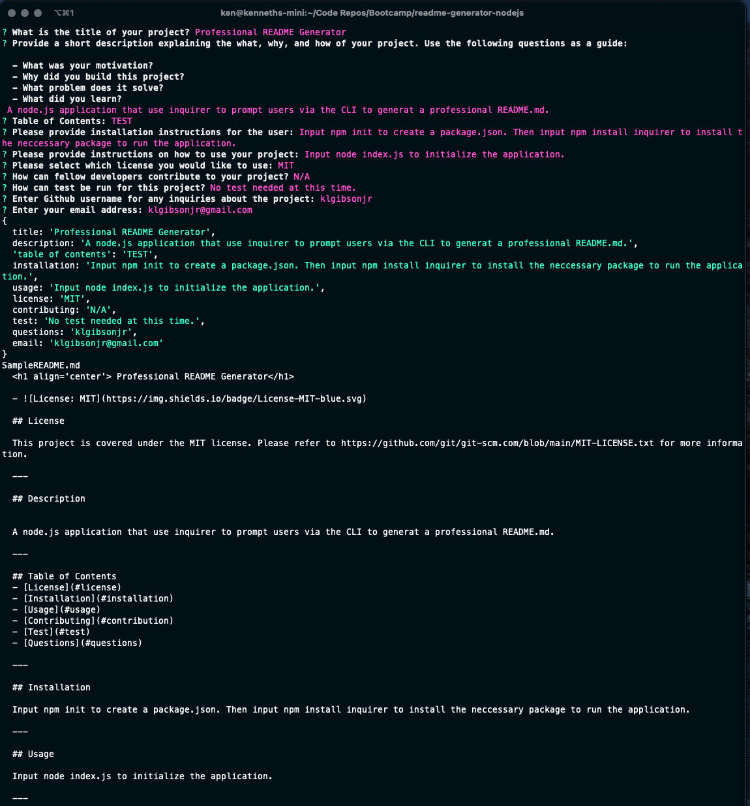
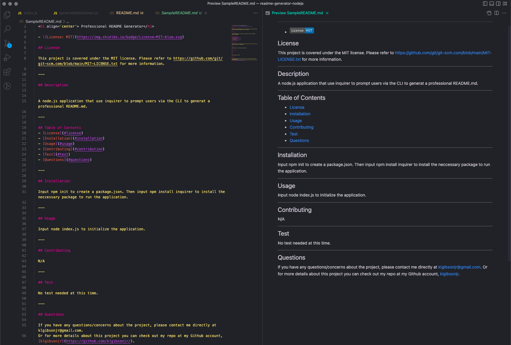

  <h1 align='center'>Professional README Generator</h1>

## License


This project is covered under the MIT license.
Please refer to https://github.com/git/git-scm.com/blob/main/MIT-LICENSE.txt for more information.

---

## Description

> This project is a node.js application that uses user input prompted from inquirer to generate a professional README.md file for their repositories. Using the command line, the user can answer a series of prompted questions that will use their input to generate a professional README.

> At the link below, you will find a video showcasing the application and how it functions.

[Walkthrough Video](https://drive.google.com/file/d/1fix5KgV1NQ6qC2ydri6SLPcyxs3kz3BI/view 'Walkthrough Video')

Below are a few screenshot showcasing the application:





---

## User Story

```
AS A developer
I WANT a README generator
SO THAT I can quickly create a professional README for a new project
```

## Acceptance Criteria

```
GIVEN a command-line application that accepts user input
WHEN I am prompted for information about my application repository
THEN a high-quality, professional README.md is generated with the title of my project and sections entitled Description, Table of Contents, Installation, Usage, License, Contributing, Tests, and Questions
WHEN I enter my project title
THEN this is displayed as the title of the README
WHEN I enter a description, installation instructions, usage information, contribution guidelines, and test instructions
THEN this information is added to the sections of the README entitled Description, Installation, Usage, Contributing, and Tests
WHEN I choose a license for my application from a list of options
THEN a badge for that license is added near the top of the README and a notice is added to the section of the README entitled License that explains which license the application is covered under
WHEN I enter my GitHub username
THEN this is added to the section of the README entitled Questions, with a link to my GitHub profile
WHEN I enter my email address
THEN this is added to the section of the README entitled Questions, with instructions on how to reach me with additional questions
WHEN I click on the links in the Table of Contents
THEN I am taken to the corresponding section of the README
```

## Table of Contents

- [License](#license)
- [Installation](#installation)
- [Usage](#usage)
- [Contributing](#contribution)
- [Test](#test)
- [Questions](#questions)

---

## Installation

The installation process is very simple.

First the user must create a package.json file by inputting the following command:

```zsh
npm init
```

Once the package.json file has been created, then input the following command to install the neccessary packages that will be used to prompt the user with the questions needed to generate their README.md file.

```zsh
npm install inquirer
```

---

## Usage

Run the following command at the root of your application the answer the prompted questions:

```zsh
node index.js
```

---

## Contributing

Aside from myself, there were no contributors to this project.

---

## Test

Not test where needed for this application.

---

## Questions

If you have any questions/concerns about the project, please contact me directly at klgibsonjr@gmail.com.
Or for more details about this project you can check out my repo at my Github account, [klgibsonjr](https://github.com/klgibsonjr/readme-generator-nodejs/).
